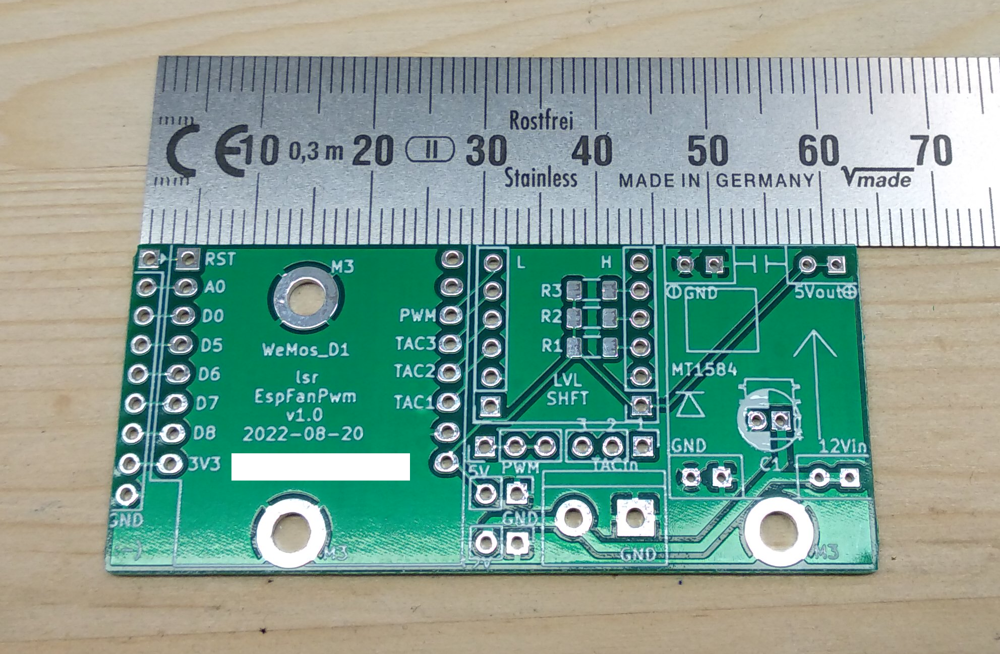

# EspFanPwm

control speed of one to three fans via PWM (9BMB12P2K01) and get the tacho signal, using a D1 mini with [ESPHome](https://esphome.io/) via [Home Assistant](https://www.home-assistant.io/). 

## Executive Summary
* This project offers a solution for providing the same speed signal to up to three fans (9BMB12P2K01) with Home Assistant (via ESPHome), utilizing a D1 mini board.
* This project consists of a KiCad project that gives you the [Gerber files](gerber/gerber.zip) to order a PCB (e.g. at [JLCPCB](https://cart.jlcpcb.com)) onto which (mostly) passive components (pinheaders/sockets) are soldered. Then you plug on some standard modules you can get from [AliExpress](https://www.aliexpress.com), create a device in Home Assistant and are pretty much done.
* For the impatient: Go to [Installation](#Installation).

## Picture

## Sidenotes
This is my third "public GitHub" project. Yeah, I copy/paste a lot of these READMEs... I made something (crude) that I nevertheless think might be useful for somebody else - this time, I think the audience is rather small, but I am publishing it regardless :-). As usual, this readme will be rather long - I want to document the story behind it for my records. 
Despite the verbosity of the README, it assumes that you know how to solder, how to work with a multimeter and your way around Home Assistant and ESPHome. Some things here are weirdly specific, while some are infuriatingly generic (assuming a lot of knowhow).

## Preamble (Why)
I did this because a crate of 9BMB12P2K01 fans fell from a truck and into my lap. Without a PWM signal they are really loud, so I wanted to control their speed. As added bonus (and to maybe find out if a fan broke) and because the fans spit this out, I also wanted to monitor the tacho signal.

## Design Decisions (and other reasoning)
### Goals
* Drive three fans with the same speed (no need for different speeds).
* The power of the fans shall not be routed over the PCB (they should be directly connected to a PSU that will also power the board). 
* Have mainly only passive components on the PCB to make it easy to solder.
* Use as many widely available off-the-shelf components and modules as possible over working directly with parts/MCUs.
* Have a compact PCB design.
* Provide separate tacho signal monitoring for each of the up to 3 fans.
* Make all voltages on the board available.
* Enable usage of unused D1 mini pins via pinheaders.
* Have enough GND pins. 
* Have short high-voltage tracks.
* Have everything socketed. 
* Have the antenna of the D1 board protrude over the PCB to avoid interference from PCB copper fill.
* The silkscreen on the board shall be self-speaking for modules over the usual 'short nomenclature' (e.g. "J1"). 
* C1 for stabilizing voltage when the fans turns on should be optional. 
* Large SMD components (THT pullup resistors would have made the board too large).
* Low cost.

### Non-goals
* No need for perfectly aligned mounting holes.
* No need for separate speed PWM signals (all 3 fans can be the same speed).
* Micro-USB port of the D1 does not need to be available when socketed (it just worked out that way here).
* No need for energy efficiency. 
* No need for "perfect" PCB/circuit design (<i>done is better than perfect</i>).

## BOM (for 1 module)
* 1 x PCB (see [Installation](#Installation))
* 1 x D1 Mini (with normal pinheaders looking 'down'; from Ali)
* 1 x 4-lane level shifter (check correct pin-out)
* 1 x MP1584 DC-DC step-down Module with LM2596 (from Ali)
* 1 x KF301- 2Pin 5.0mm screw-terminal (from Ali)
* 2 x 1x8pin female pinheaders 2.54 mm (from Ali)
* 2 x 1x6pin female pinheaders 2.54 mm (from Ali)
* 4 x 1x2pin female pinheaders 2.54 mm (from Ali)
* 3 x 1206_3216 10k SMD resistor (for pullup)

* standard 1 row 2.54mm male pinheaders
* (optional) 1 x capacitor (>= 12V, THT radial D5.0mm / P2.00mm)

## Installation
This will be long. Brace.

### Order PCBs
* Go to [JLCPCB](https://cart.jlcpcb.com/quote) and upload the [gerber.zip](gerber/gerber.zip). Sidenote: I'm neither sponsored nor do I endorse them specifically, I just find them convenient. Make sure you select the correct PCB thickness (1.2 mm). I also set "Remove Order Number" to "Specify a location" (layout contains a field for this). No other special settings.

### Soldering
* Solder the components. No special advice here - it should be pretty straight forward.
* Solder the SMD pullup resistors first.
* If you populate the C1 capacitor, make sure you leave enough 'height' of the legs to fold it down 90 degrees to lie flat (otherwise the A4988 won't fit above).

### Tuning
* <b>BEFORE</b> putting on all modules and connect power, tune the MP1584 to 5V output. Do this <b>now</b>.

### Assemply
* Put all modules on the board. Take care of the orientation - there is absolutely no safeguard against voltage reversal or such things.
* Provide 12V input (VCC is left on the screw terminal, GND is right).
* The 9BMB12P2K01 cables are:

|row #|color|what|D1_mini pin
---| --- | --- | ---
1|BLK|GND | none (PSU directly)
2|RED|VCC (12V) | none (PSU directly)
3|YLW|tacho (output from fan) | D2, D3, D4
4|BRN|PWM signal (input to fan) | D1 (all three fans)

### Software
* It is assumed you have a working instance of Home Assistant with a working ESPHome plugin. If not, please google how to get there.
* Create an ESPHome device in Home Assistant with the configuration as basis noted in [this file](HomeAssistant/EspFanPwm.yaml). Modify to your gusto.

### Caveats / FAQ
* This is not the work of a professional, and thus has not been load/fuzzy/destructive-tested. All things could happen, thus this project comes without any warranty. Never use it anywhere in a production situation.

* You can't solder the MP1584 directly on the board even if you don't care about the mouting-hole: The holes for the pins are too small (only the female pin-headers fit, but no the male pinheaders directly). This might be changed on a v2 of the board.

* The mounting holes are connected to GND because ... no reason. 

* There is intentionally no ESPHome binary provided for download and flashing here.

* I'm neither affiliated with nor do I get money from JLC nor Ali, I just find both convenient. 

* Why is there no YT video describing this whole thing? - B/c IMHO YT sucks for technical documentation. 

* The KiCad project does not have all components/footprints - I got them from various online sources and didn't track the copyright - sorry.

* I found a datasheet for the 9BMB12P2K01, but it is not provided here b/c I don't know how copyright works. 

## License and Legalese
* May be (re)used for personal/private use only and not sold/licensed for commercial or financial gain. This non-standard license should make it impossible and really difficult for commercial enterprises to profit from my work (pay people to design this!), but enable the hobbyist/enthusiast to work with it.
* If I have inadverently (re-)used your work without either properly attributing it or something, please let me know - I'd be happy to correct this.

## Donations
Yes please.

## Feedback
Also yes please! (I hope I figure out how this whole pull-request thing works...)

## Shoutout ...
* ... to [CCC](https://www.ccc.de) and [CCCZH](https://www.ccczh.ch/)!
* ... to all FOSS contributors that helped making SW that enabled me to do this. Nanos gigantium humeris insidentes.
